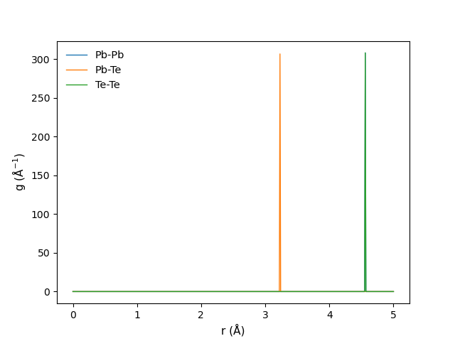
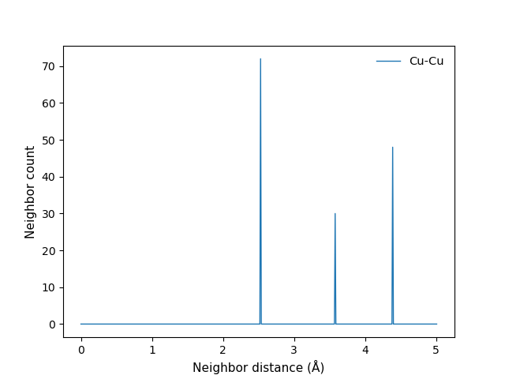

pyCSRO: a python package for calculating chemical short range ordering.
===================================================================================================

pyCSRO is a python package using pairwise multi-component short-range order (PM-SRO) parameters to discover the chemical short range ordering in materials, including crystalline, amorphous, and high-entropy alloys, etc.
The PM-SRO parameter was extended from the Warren-Cowley short-range order (WC-SRO) to describe the local distribution of element pairs in the multicomponent system, which is defined as:

$$\alpha_{ij}^m=\frac{p_{ij}^m - X_j}{X_j-1}\quad \text{($i = j$, for pairs of same species)}$$

$$\alpha_{ij}^m=\frac{p_{ij}^m - X_j}{-X_j}\quad \text{($i ​\neq j$, for pairs of different species)}$$

where $p_{ij}^m$ is the average probability of finding a $j$-type atom around an $i$-type atom in the $m$-th shell, and $X_j$ is the overall concentration of $j$ atoms in the system.
A negative value of $\alpha_{ij}^m$ indicates the tendency of mixing of $i$ and $j$ atoms, whereas a positive one suggests the tendency toward segregation of $i$ and $j$ atoms. And the value of $\alpha_{ij}^m$ would be zero if $i$ and $j$ atoms are randomly distributed.

Note that in order to keep the same meaning of the $\alpha_{ij}^m$ value when $i=j$ and $i ​\neq j$, such that a negative $\alpha_{ij}^m$ means tendency of mixing and a positive $\alpha_{ij}^m$ means tendency of segregation, the equation of PM-SRO for $i = j$ has been rewritten.

Required Dependencies:
------------
* Python 3.9+
* matplotlib
* numpy
* scipy
* ase
* pymatgen


Installation
------------
The pyCSRO package requires Python 3.9 or later, and run the following command to install it:
```
pip install pycsro
```

If you prefer to install from sources, navigate to the source archive directory and run:
```
python setup.py install
```


Usage
--------
```
from pycsro.main import run_pycsro_pmsro
run_pycsro_pmsro(ion1, cutoff1, file_name, cutoff2, save_name, skip_distance, plot_save, cal_same_pair, safe_mode, partial_neighbors)
```

- `ion1`: The selected elements for the PM-SRO calculation. (Required, range: elements in the structure model, type: str)

- `cutoff1`: The cutoff of thr 1st shell. (Required, range: positive number, type: float)

- `cutoff2`: The cutoff of the 2nd shell. (Cutoff2 should be equal or greater than cutoff1, range: positive number, type: float)

- `file_name`: The absolute path of input file. (Required, type: str)

- `save_name`: The absolute path of saved file. (type: str)

- `skip_distance`: Skip the neighbor distance under this parameter. (Default: 0.1, range: positive number, type: float)

- `cal_same_pair`: Whether calculate the wcp of same elements but different center atoms. (Default: Yes, range: Yes or No, type: str)

- `safe_mode`: Whether use the supercell selection function, which can reduce the calculation time. (Default: No, range: Yes or No, type: str)

- `plot_save`: Whether save the neighbor plot. (Default: No, range: Yes or No, type: str)

- `partial_neighbors`: Whether plot the partial neighbor distribution of atoms in the cell. (Default: No, range: Yes or No, type: str)

- `xyz`: Whether use the xyz mode to read input file. (Default: No, range: Yes or No, type: str)

Attention: 
1. The calculation requires the user to input parameters of `ion1`, `cutoff1`, and `file_name`.
2. Supported input file formats incllude `CIF`, `POSCAR`, `xyz`, and more.
3. For compounds, cations and anions should be placed in different ion groups, and calculated separately.
4. You can try a larger cutoff value at the first time, and then adjust the cutoff value to the trough of the neighbor distribution.
5. The second shell was defined as cutoff1 to cutoff2.
6. Noremaly, the program automatically detects the xyz input file without specifying an additional xyz parameter. This parameter can be manually selected when the automatic judgment fails.
7. When the input file is in xyz format, the radial distribution function will be switched to the local neighbor statistics function.


Example
--------
Example models are placed at `/example/`.

The basic command for running PbTe system:
```
run_pycsro_pmsro(ion1='Pb Te', cutoff1=3.7, cutoff2=5, file_name='PbTe_pcell.vasp', save_name='PbTe.txt', partial_neighbors='y')
```

The output:
```
+-----------------------------------------------------------------------------
| Element group: ['Pb', 'Te']
| Cutoff for the 1st shell: 3.7 Å       Cutoff for the 2nd shell: 5 Å
| Read file: PbTe_pcell.vasp       Save file: PbTe.txt
| Skip neighbor distance under 0.1 Å
| Calculate same pair: Yes       Safe mode: No
+-----------------------------------------------------------------------------
| The PM-SRO parameter for ['Pb', 'Te'] element group in the 1st shell
| Pb-Pb 1.0
| Pb-Te -1.0
| Te-Pb -1.0
| Te-Te 1.0
+-----------------------------------------------------------------------------
| The PM-SRO parameter for ['Pb', 'Te'] element group in the 2nd shell
| Pb-Pb -1.0
| Pb-Te 1.0
| Te-Pb 1.0
| Te-Te -1.0
+-----------------------------------------------------------------------------
```



The basic command for running Cu xyz system:
```
run_pycsro_pmsro(ion1='Cu', cutoff1=3, cutoff2=5, file_name='Cu.xyz', save_name='Cu.txt', partial_neighbors='y')
```

The output:
```
+-----------------------------------------------------------------------------
| Element group: ['Cu']
| Cutoff for the 1st shell: 3 Å       Cutoff for the 2nd shell: 5 Å
| Read file: Cu.xyz       Save file: Cu.txt
| Skip neighbor distance under 0.1 Å
| Calculate same pair: Yes       Safe mode: No
+-----------------------------------------------------------------------------
| Reading the XYZ file!
+-----------------------------------------------------------------------------
| The PM-SRO parameter for ['Cu'] element group in the 1st shell
| Cu-Cu 0.0
+-----------------------------------------------------------------------------
| The PM-SRO parameter for ['Cu'] element group in the 2nd shell
| Cu-Cu 0.0
+-----------------------------------------------------------------------------
```


Contacts
--------

For more information, please email Prof. Long Yang at long_yang@tongji.edu.cn
 